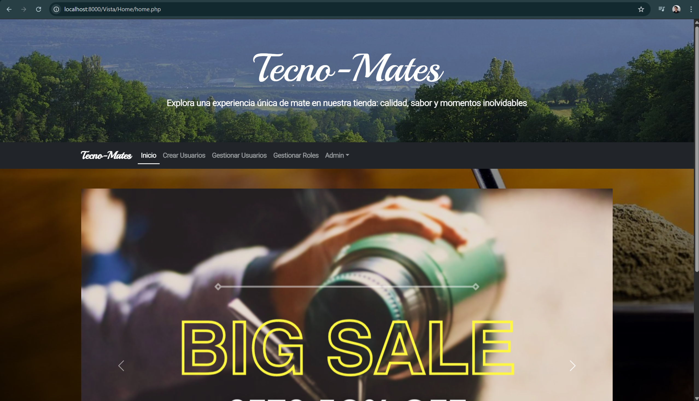
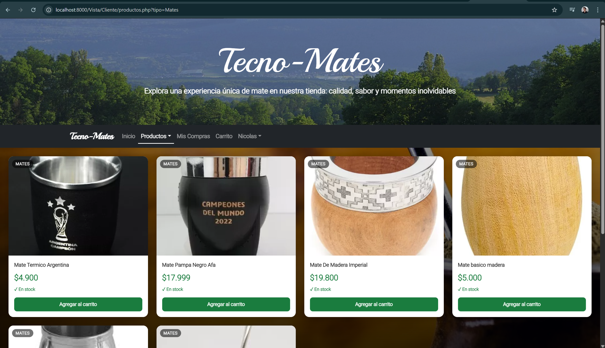
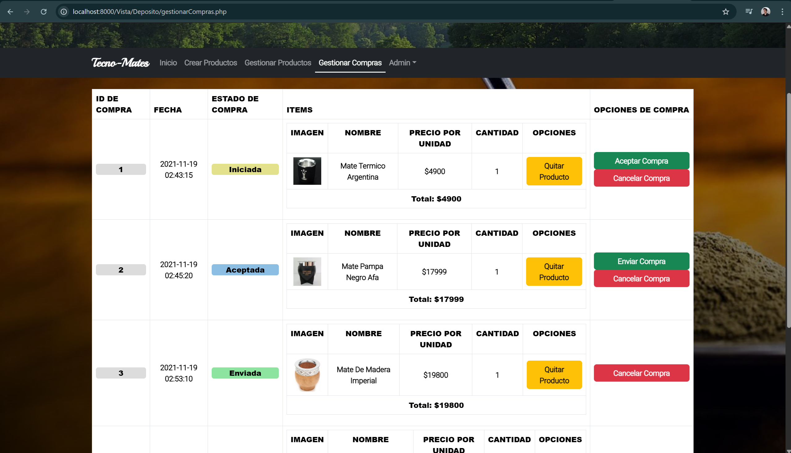

<div align="center">

Programación Web Dinámica 2023

# Grupo 02.1 — Trabajo Final PWD

### Tecno-Mates · E-commerce de productos de mate

## Integrantes

<table>
    <tr><td>Borghese Nicolas</td></tr>
    <tr><td>La Forgia Floriana</td></tr>
</table>

</div>

---

## Sobre el proyecto

**Tecno-Mates** es el trabajo final de la materia **Programación Web Dinámica (PWD)** desarrollado en la Universidad Nacional Del Comahue (UNCOMA). Se trata de un e-commerce de productos relacionados al mate — mates, yerbas, bombillas, termos y sets — construido con PHP, PostgreSQL y Bootstrap 4 bajo arquitectura MVC.

### ¿Qué permite hacer?

- 🛍️ **Clientes** — explorar el catálogo de productos, agregar ítems al carrito y confirmar compras. Seguimiento del historial de pedidos con estado actualizado en tiempo real.
- 🏪 **Depósito** — gestionar el stock de productos (crear, modificar, eliminar) y administrar el flujo de compras (aceptar, enviar, cancelar pedidos).
- 👤 **Administradores** — gestión completa de usuarios, asignación de roles y configuración del menú de navegación por rol.
- 🔐 **Sistema de roles** — un usuario puede tener múltiples roles simultáneos y cambiar entre ellos desde su perfil.

Repositorio original: https://github.com/Alter1412/PWDTPFinal

---

## Capturas

<div align="center">

**Página de inicio**


**Catálogo de productos**


**Panel de gestión de compras (Depósito)**


</div>

---

## Requisitos previos

Antes de comenzar, asegurate de tener instalado:

- **PHP 8.0 o superior** con la extensión `pdo_pgsql` habilitada
- **PostgreSQL 14 o superior**

> Para verificar que PHP tiene el driver de PostgreSQL, ejecutá:
>
> ```bash
> php -m | grep pdo_pgsql
> ```
>
> Si no aparece `pdo_pgsql`, tenés que habilitarlo en tu `php.ini` descomentando la línea `extension=pdo_pgsql`.

---

## Instalación paso a paso

### 1. Clonar el repositorio

```bash
git clone https://github.com/NicolasBorghese/Tecno_Mates.git
cd Tecno_Mates
```

### 2. Crear la base de datos en PostgreSQL

Conectate a PostgreSQL con tu usuario (por defecto `postgres`) y creá la base de datos:

```bash
psql -U postgres -c "CREATE DATABASE bdcarritocompras ENCODING 'UTF8';"
```

> Si tu usuario de PostgreSQL no es `postgres`, reemplazá `-U postgres` por tu usuario en todos los comandos.

### 3. Ejecutar el schema

Cargá las tablas y los datos de prueba:

```bash
psql -U postgres -d bdcarritocompras -f modelo/sql/bdcarritocompras_pg.sql
```

Deberías ver una salida con `CREATE TABLE`, `INSERT` y `setval` para cada tabla. Si no hay errores, la base de datos está lista.

### 4. Configurar la conexión a la base de datos

Abrí el archivo `modelo/conector/BaseDatos.php` y modificá las credenciales según tu instalación de PostgreSQL:

```php
$this->user = 'postgres';   // tu usuario de PostgreSQL
$this->pass = '1234';       // tu contraseña de PostgreSQL
$this->host = 'localhost';  // host (no cambiar si es local)
$this->database = 'bdcarritocompras'; // no cambiar
```

### 5. Levantar el servidor web

Desde la **raíz del proyecto** (`Tecno_Mates/`), ejecutá el servidor integrado de PHP:

```bash
php -S localhost:8000
```

Dejá esa terminal abierta mientras usás el proyecto.

### 6. Abrir en el navegador

```
http://localhost:8000/Vista/Home/home.php
```

---

## Usuarios de prueba

| Usuario      | Contraseña | Rol                        |
| ------------ | ---------- | -------------------------- |
| `Admin`      | `1234`     | Administrador              |
| `Deposito`   | `1234`     | Depósito                   |
| `Cliente`    | `1234`     | Cliente                    |
| `AdminTotal` | `1234`     | Admin + Depósito + Cliente |

---

## Estructura del proyecto

```
Tecno_Mates/
├── configuracion.php       # Configuración de rutas y sesión
├── index.php               # Punto de entrada
├── modelo/
│   ├── conector/
│   │   └── BaseDatos.php   # Conexión PDO a PostgreSQL ← credenciales aquí
│   ├── sql/
│   │   └── bdcarritocompras_pg.sql  # Schema PostgreSQL
│   └── *.php               # Modelos (Usuario, Producto, Compra, etc.)
├── control/
│   └── *.php               # Controladores ABM
├── vista/
│   ├── Estructuras/        # Header, navbar, footer, banner
│   ├── Home/               # Páginas públicas (login, registro, productos)
│   ├── Administrador/      # Panel de administración
│   ├── Deposito/           # Panel de depósito
│   └── Cliente/            # Panel de cliente (carrito, compras)
└── Util/
    └── funciones.php       # Autoloader y utilidades
```

---

## Solución de problemas frecuentes

**`php -S` no se reconoce como comando**
→ PHP no está en el PATH del sistema. Buscá dónde está instalado (ej: `C:\php\php.exe`) y usá la ruta completa, o agregalo al PATH.

**Error de conexión a la base de datos (`could not connect to server`)**
→ Verificá que el servicio de PostgreSQL esté corriendo. En Windows podés buscarlo en `services.msc` como `postgresql-x64-17` y asegurarte de que esté iniciado.

**`password authentication failed for user "postgres"`**
→ La contraseña en `BaseDatos.php` no coincide con la de tu instalación de PostgreSQL. Corregila en el paso 4.

**`pdo_pgsql` extension not found**
→ Abrí tu `php.ini` (ubicación: `php --ini`), buscá la línea `;extension=pdo_pgsql` y eliminale el `;` del principio. Reiniciá el servidor.
